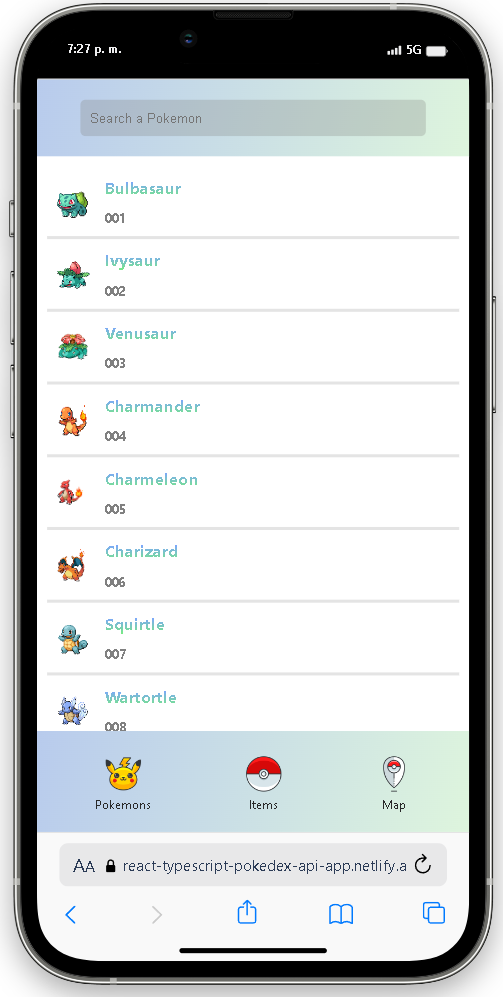
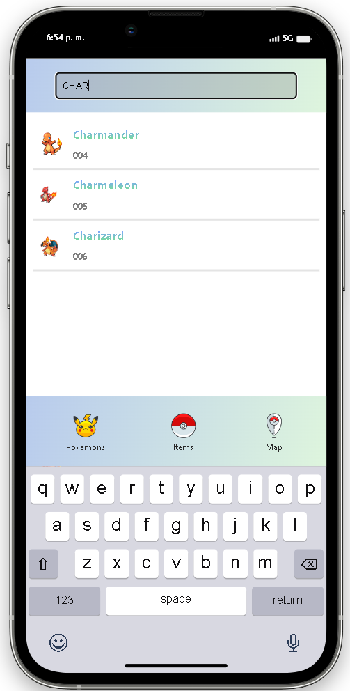
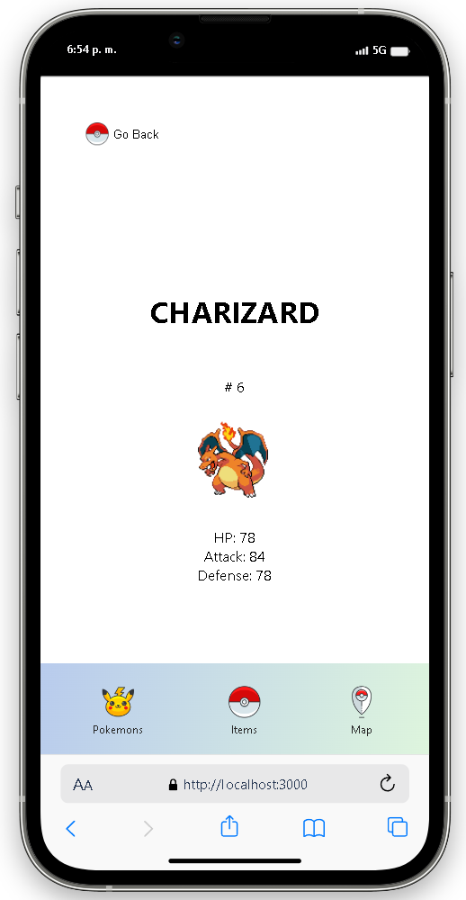
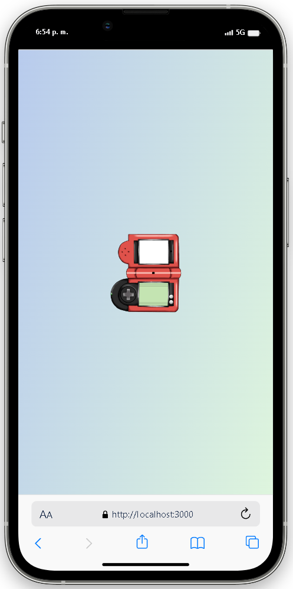

# POKEDEX

Poject created, using:

- React
- TypeScript
- BrowserRouter
- API Fetch

## URL DEPLOYED PROJECT: 
https://react-typescript-pokedex-api-app.netlify.app/

### MAIN SCREEN

### SEARCH

### DETAIL SCREEN - SELECTED

### LOADING SCREEN

