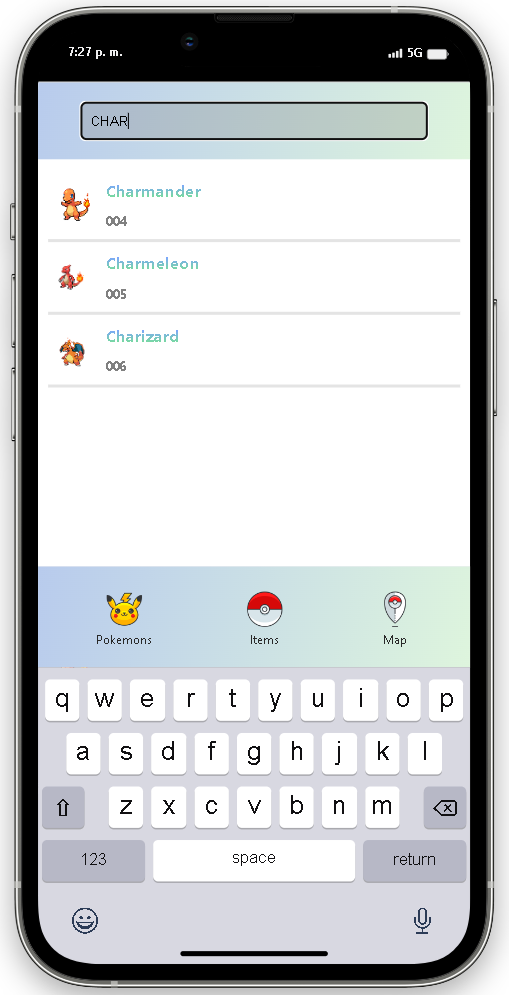
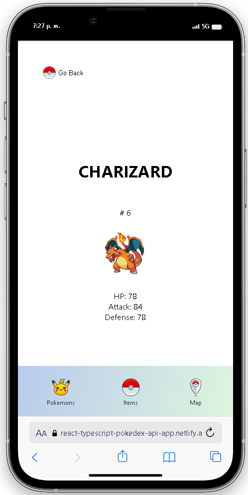

# POKEDEX

Poject created, using:

- React
- TypeScript
- Components
- Hooks: useState, useEffect, useNavigation
- React Router DOM: for creating routes, pages, and SPA navigation between them
- Fetch from external APIs (2 different ones in this case)
- TypeScript with React combination
- TypeScript types
- CSS modules

## URL DEPLOYED PROJECT: 
https://react-typescript-pokedex-api-app.netlify.app/

### MAIN SCREEN

### SEARCH

### DETAIL SCREEN - SELECTED

### LOADING SCREEN

